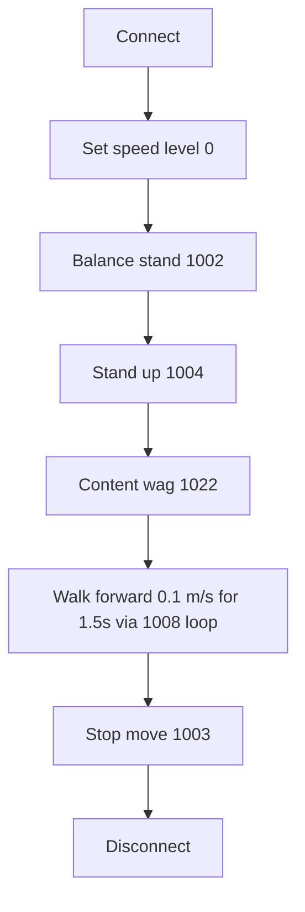
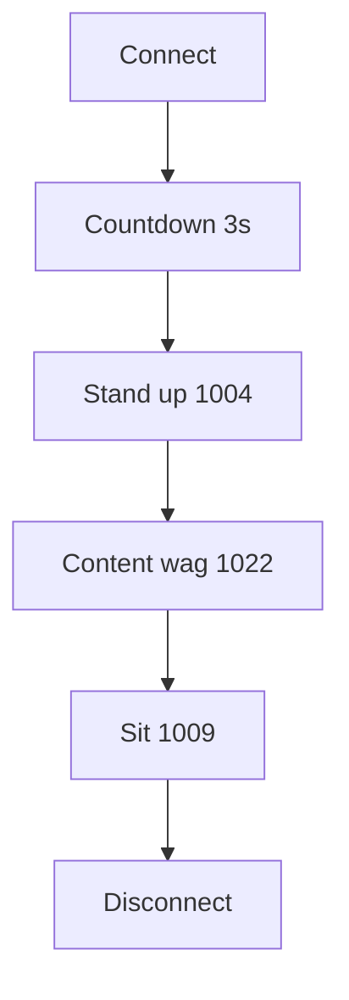
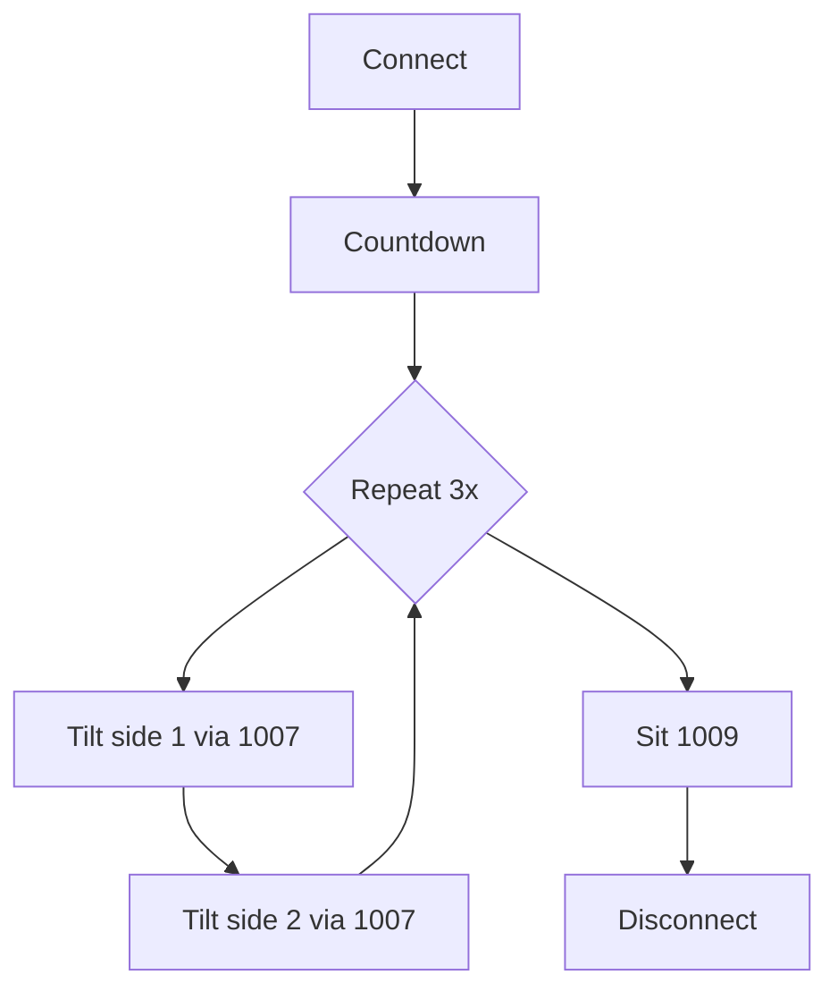
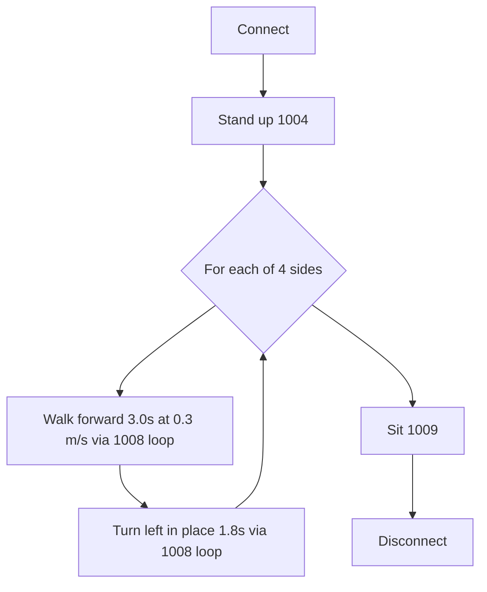
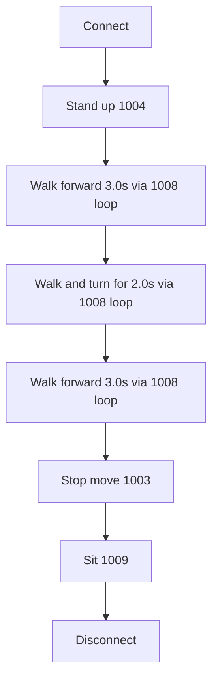
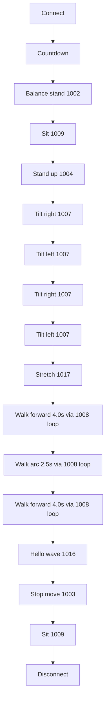
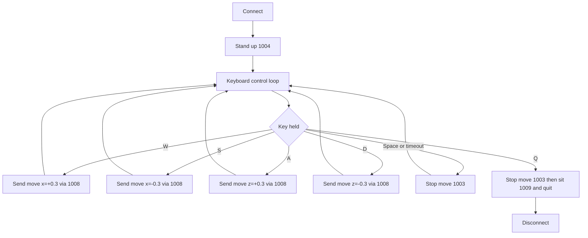
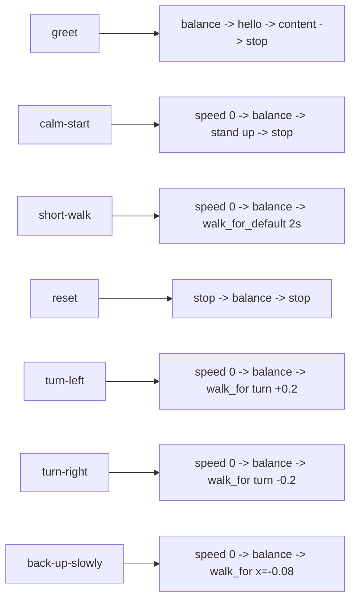

# Go2 Movement Visuals

This document shows the movement flow for each robot control program in this repository.

## Legend

- `1002` balance stand
- `1003` stop move
- `1004` stand up
- `1007` euler body tilt
- `1008` move (walk/turn)
- `1009` sit
- `1016` hello wave
- `1017` stretch
- `1022` content (happy wag)

## demo.py

## stand_wag_sit_example.py

## repeat_tilt_sit.py

## square_walk_sit.py

## walk_turn_walk_sit.py

## performance_routine.py

## pynput_teleop.py

## cli.py preset routines

